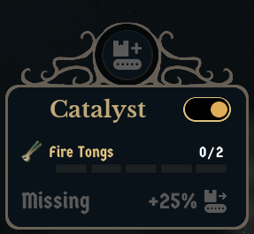

# CatalystDefaults

A quality-of-life mod for [Whiskerwood](https://store.steampowered.com/app/2489330/Whiskerwood/).

Production buildings with a Catalyst slot start with the Catalyst switched **off**, so every new smelter or furnace needs a trip into its window. CatalystDefaults switches it **on** as soon as the building is finished.

## Features

- **One setting**: *Production buildings - Catalyst on when built* in the Mods menu, On / Off (default **On**).
- **New buildings only**: buildings finished while the mod is active. Buildings that already exist when a save loads are never looked at or changed.
- **Uses the game's own command**: the same one the Catalyst switch in the building window sends, so nothing is patched.
- **Event-driven, no polling, no full scans**: the mod sleeps until a construction finishes. Houses, walls, belts and other non-production buildings are dropped after one data-table lookup. For a production building it lists only buildings of that one type and picks the one standing on the finished construction's cell. It costs nothing at 20× speed or in a town with thousands of buildings.

## Installing

- **Manually:** put `CatalystDefaults.pak` and `CatalystDefaults.uplugin` in
  `%localappdata%\Whiskerwood\Saved\mods\CatalystDefaults\` (create the folder; file names must stay `CatalystDefaults.*`).
- The setting is under **Settings → Mods**. A change applies to buildings finished after it.

## Repository layout

| Path | What |
|---|---|
| `Mod/CatalystDefaults/` | The mod's source assets (`.uasset`) and `CatalystDefaults.uplugin`. This is the whole mod. |
| `docs/graphs/` | Blueprint graphs as copy-paste text (T3D). Reference only: the `.uasset` files are the source of truth. |
| `tools/` | `t3d.py` + `catalystdefaults_build.py`: Python generator that writes the graphs in `docs/graphs/` from the modkit's reflection dump. |
| `workshop/` | SteamCMD item file (`CatalystDefaults.vdf`) and [upload steps](workshop/HOW_TO_UPLOAD.md). The preview image is `docs/screenshot.png`. |
| `sync-from-modkit.bat` | Copies the mod's assets from the modkit into this repo and stages the built `.pak` + uplugin into `workshop/content/`. |
| `sync-to-steam.bat` | Uploads `workshop/content/` to the Workshop with SteamCMD. |

## Building from source

1. Set up the official [Whiskerwood modkit](https://github.com/Whiskerwood-Modding/Whiskerwood-Project) (custom UE 5.8 build, see its README; the mod is built for the UE 5.8 version of the game).
2. Copy `Mod/CatalystDefaults/` from this repo to `Content/Mods/CatalystDefaults/` in the modkit project.
3. Open the project, right-click the `CatalystDefaults` folder → **Cook & Install** (Mod Tools). The mod uses pak chunk 23 (`PAL_CatalystDefaults`).
4. After editing in the editor, run `sync-from-modkit.bat` to copy the changed assets back into `Mod/CatalystDefaults/`, then commit.
   The script assumes the modkit is at `E:\modding\Whiskerwood-Project`; override with `set MODKIT=D:\other\path` first.

### Creating the assets from scratch / regenerating a graph

`python tools/catalystdefaults_build.py` writes fresh paste text into `tools/out/`. It needs the modkit's `Content/DynamicClasses/Whiskerwood-*.jmap.gz`; set `JMAP=...` if it isn't next to this repo. In the asset's event graph: Ctrl+A, Delete, Ctrl+V, then compile.

- `BP_Startup` and `BP_MapLoad` are **Actor** Blueprints. `PAL_CatalystDefaults` is a Primary Asset Label with Chunk ID 23, *Label Assets In My Directory* on, Cook Rule *Always Cook*.
- `BP_MapLoad` variables must exist before pasting:

  | Variable | Type |
  |---|---|
  | `Debug` | Boolean |
  | `View` | IndustryDetails, object reference |
  | `Cur` | Actor, object reference |
  | `TableName` | Name |
  | `AnyLeft` | Boolean |
  | `PendClass` | Actor, **class** reference, **array** |
  | `PendPos` | String, **array** |
  | `PendLoc` | Vector, **array** |
  | `PendTries` | Integer, **array** |

- If a red event wire (OnConstruction, OnSiteGone, OnBuilt → its *Bind Event* node) pastes unconnected, drag it again. Same for the *Cast To Actor Class* output into *Add (PendClass)*.

## How it works

| Asset | Role |
|---|---|
| `BP_Startup` | Runs once at the main menu and registers the mod option `CatalystDefaults_On`. |
| `BP_MapLoad` | Runs when a save loads. It binds the mod API events and handles newly finished buildings (below). |
| `PAL_CatalystDefaults` | Primary Asset Label that puts the mod into its own pak chunk. |

- A building's Catalyst switch is `Industry.m_allowCatalysts`. The building window class (`IndustryDetails`) accepts a `setCatalystUse` action. `BP_MapLoad` keeps one invisible `IndustryDetails`, points its `Context` at the building with `SetObjectPropertyByName` (the property isn't Blueprint-writable) and sends the action.
- **When the mod runs:**
  - **`onConstructionSpawned`:** the mod binds that construction site's `OnDestroyed` (fires when the site finishes or is cancelled).
  - **Site gone:** the site's `m_gridActorToBuild` is the building's row in the building data table (asset `GridactorDefs_Sync`, mod API name `GridDefsSync`). If the row has neither `asIndustryDef` nor `catalyst`, the mod stops there. Otherwise it reads the row's `GridActor` class and puts that class plus the site's root cell and location on a short pending list, and starts a one-shot 1-second check (if one isn't already running).
  - **Check:** for each pending entry, the mod lists only actors of that one class and takes the one on the same root cell (or at the same location). If it has a Catalyst slot that is still off, it's switched on. Entries not found yet are retried up to four times, which is also how cancelled constructions drop out. When nothing is left the list is cleared.
  - **`onBuildingSpawned`:** buildings placed without a construction site are handled directly (exactly that actor).
- `onBuildingSpawned` doesn't fire for buildings finished through construction in game version 0.7.207, which is why the site route exists.

## Debug logging

The mod logs nothing by default. To see what it does, create a `debug.txt` next to the pak containing any text (e.g. `1`; an empty file counts as off):
`%localappdata%\Whiskerwood\Saved\mods\CatalystDefaults\debug.txt`.
It is read once when a save finishes loading. Then `%localappdata%\Whiskerwood\Saved\Logs\modlog.txt` gets a line at load (which table is used),
for every finished production construction, for every catalyst switched on, and for any construction it couldn't match.
The Workshop upload never contains `debug.txt`, so published copies stay silent.

## Known limitations

- Changing the setting applies only to buildings finished after the change.
- If a game update renames the building table (mod API name `GridDefsSync`), the mod does nothing; with `debug.txt` it logs the table names the game knows.

## Credits

Created using the Whiskerwood modkit: https://github.com/Whiskerwood-Modding/Whiskerwood-Project
